<h1 align="center">
  <a href="https://github.com/SamTheCoder777/Custom-Spotify-Manager">
    Custom Spotify Manager
  </a>
</h1>

<div align="center">
  Allows user to freely manage their spotify. The user can create playlists filled with a certain genre, or get random songs from their multiple playlists and many more.!
  <br />
  <br />
  <a href="https://github.com/SamTheCoder777/Custom-Spotify-Manager/issues/new?assignees=&labels=bug&title=bug%3A+">Report a Bug</a>
  ·
  <a href="https://github.com/SamTheCoder777/Custom-Spotify-Manager/issues/new?assignees=&labels=enhancement&title=feat%3A+">Request a Feature</a>
  .
  <a href="https://github.com/SamTheCoder777/Custom-Spotify-Manager/discussions">Ask a Question</a>
</div>

<div align="center">
<br />

[](LICENSE)
[](https://github.com/SamTheCoder777/Custom-Spotify-Manager/releases/)
[](https://www.codefactor.io/repository/github/samthecoder777/custom-spotify-manager)
[](https://github.com/SamTheCoder777/Custom-Spotify-Manager/actions/workflows/codeql.yml)


[](https://www.microsoft.com/ "Go to Microsoft homepage")
[](https://github.com/SamTheCoder777)

</div>

<details open="open">
<summary>Table of Contents</summary>

- [About](#about)
  - [Built With](#built-with)
  - [Roadmap](#roadmap)
- [Getting Started](#getting-started)
  - [Downloading Windows Terminal (Optional)](#downloading-windows-terminal-optional)
  - [Prerequisites](#prerequisites)
  - [Usage](#usage)
    - [Running Custom Spotify Manager](#running-custom-spotify-manager)
    - [Set Up the Program](#set-up-the-program)
    - [List of Commands](#list-of-commands)
- [Extra Tutorials](#extra-tutorials)
    - [Remix Playlists](#remix-playlists)
- [Disclaimer](#disclaimer)
- [FAQ](#faq)
- [Contributing](#contributing)
- [Support](#support)
- [License](#license)
- [Acknowledgements](#acknowledgements)

</details>

---

Key features of **Custom Spotify Manager**:

- Search artists or genres by their name
- Search top tracks for a given artist
- Search for all existing genres
- Find out who are your top artists
- Find out what are your top songs
- Create "My top songs" playlist anytime instead of getting one by Spotify at the end of the year
- Get a playlist filled with your favorite artists
- Create a playlist filled with random songs from set category playlists
- Create a playlist with random songs from a list of playlists
- Create a playlist filled with artists erlated with given genres
- Create a playlist filled with recommended songs of a genre
- Look cool
</td>
</tr>
</table>

### Built With

- [Spotify API](https://developer.spotify.com/documentation/web-api/)
- [Spotify Web API Java](https://github.com/spotify-web-api-java/spotify-web-api-java)
- [Jansi](https://github.com/fusesource/jansi)
- [IP-API](https://ip-api.com/)

### Roadmap

You can see all the planned features for this program [here](https://github.com/SamTheCoder777/Custom-Spotify-Manager/issues/15)

This list is a subject to change

## Getting Started

### Downloading Windows Terminal (Optional)

You can download a better version of **Windows Command Prompt** called **Windows Terminal**
([download link](https://www.microsoft.com/store/apps/9n0dx20hk701))

You will be able to click links and characters will not be broken

### Prerequisites

Make sure you have Java 17 installed.
> The characters may not correctly render in higher or lower versions

You can easily run this program in Windows command list.
> This program is not tested on other operating systems.

You can verify your java version in CMD with:

```sh
java -version
```

### Usage

#### Running Custom Spotify Manager

After downloading the program, in the program directory:

```sh
java -jar CustomSpotifyManager.jar
```

Or in windows, you can run the provided batch file named: runCustomSpotifyManager.bat


#### Set Up the Program

Please follow these steps:
1. Go to spotify developer dashboard ([here](https://developer.spotify.com/dashboard/login)) and log in

2. On the dashboard, click create an app and follow instructions
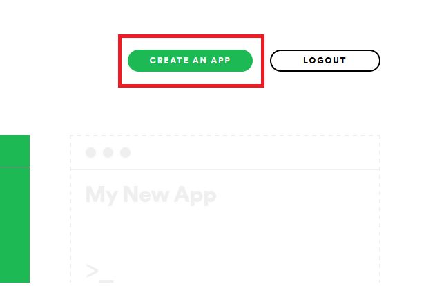

3. In the top right corner, click edit settings
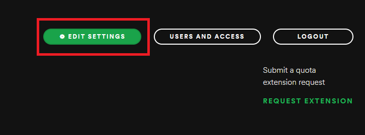


4. In the "Redirect URIs" section, write and click add:
> http://localhost:8080

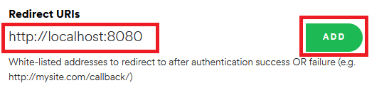

5. Scroll down and save

6. At top right, the clientID and token (click "show client secret") are located

7. Open setup.txt and paste your clientID and token (client secret) into the provided space


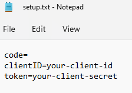

8. Restart program if it was open

9. Run command:
```sh
init
```
10. Click agree on the opened browser and your program should be set
>If the browser does not open automatically, move on to the next step
<br>

</br>

**If nothing happens:**

11. Copy and paste the returned url into your browser.

12. Click agree and paste your code into setup.txt:
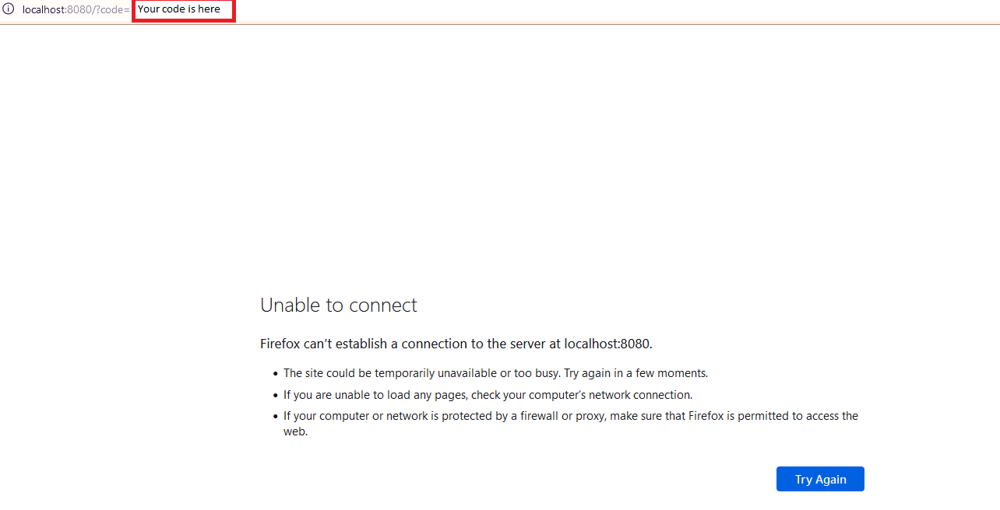


12. At this step, your setup.txt should looke like:


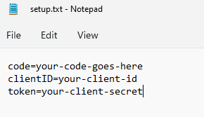


13. Press enter in the program and you are all set!

#### List of Commands

The commands are not case sensitive


| Name                            | command                         | Description                                                                                        |
|---------------------------------|---------------------------------|----------------------------------------------------------------------------------------------------|
| Initialize                      | init                            | Set up program for the first run                                                                   |
| Create Category Playlist        | CreateCategoryPlaylist          | Creates playlist filled with the songs from category playlist                                      |
| Remix Playlists                 | RemixPlaylists                  | Creates playlist filled with random songs from the given playlistsIDs provided in playlistList.txt |
| Create Explore Artists Playlist | Create Explore Artists Playlist | Create playlists filled with artists related with given genre                                      |
| Create Playlist                 | CreatePlaylist                  | Creates playlist with given name                                                                   |
| Create Recommended Playlist     | CreateRecommendedPlaylist       | Creates playlist filled with recommended songs for a given genre                                   |
| Get Artist's Top Tracks         | GetArtistsTopTracks             | Prints out top tracks for a given artist                                                           |
| Get Category List               | GetCategoryList                 | Prints out list of categories available                                                            |
| Get Genre List                  | GetGenreList                    | Prints out whole list for all available genres                                                     |
| Get My Top Artists              | GetMyTopArtists                 | Prints out the user's most played artists and you can add songs by these artists to a playlist     |
| Get My Top Tracks               | GetMyTopTracks                  | Prints out the user's most played tracks and you can add these songs to a playlist                 |
| Get Recommendations             | GetRecommendations              | Prints out recommended tracks for a given genre                                                    |
| Search Artists                  | SearchArtists                   | Searches for the artist with given name                                                            |
| Search Genre                    | SearchGenre                     | Prints out genre that starts with given character                                                  |

## Extra Tutorials
### Remix Playlists
1. Go to the page of one of playlists you want to get random songs from
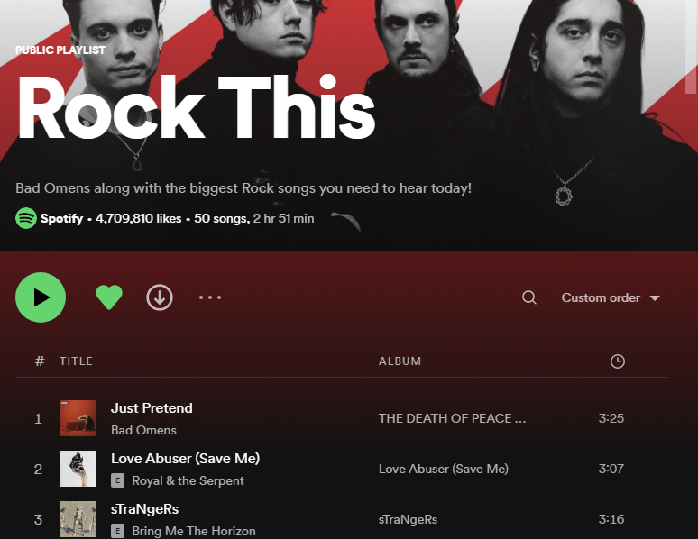

2. Click on the "three dots"

3. Click on "Copy link to playlist"
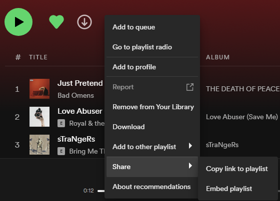

> https://open.spotify.com/playlist/37i9dQZF1DXcF6B6QPhFDv?si=acdd9277122146e5

4. Get the ID from the link
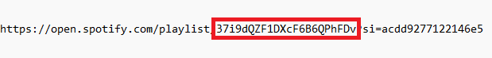

> 37i9dQZF1DXcF6B6QPhFDv

5. Add it to the **playlistList.txt** and make sure to **SAVE** the file
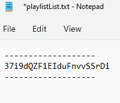

6. You can add multiple IDs by separating each IDs with new lines
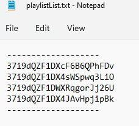

> Do not delete the hyphens in the file or the program may not work as expected

## Disclaimer
**Custom Spotify Manager is not endorsed by Spotify and does not reflect the views or opinions of Spotify or anyone officially involved in producing or managing Spotify properties. Spotify and all associated properties are trademarks or registered trademarks of Spotify, Inc**

Command **"CreateCategoryPlaylist"** may not work consistently due to Spotify not supporting some category playlists in
some countries or offers very limited amount of category playlists. If it does not work as expected, please use **"
RemixPlaylists"** instead by adding the ID of the playlists you wanted to get random songs from in **playlistList.txt**

## FAQ

**Language characters are shown as question marks in the command prompt**

Change your cmd to UTF-8 format. Here is a good place to start [Link](https://superuser.com/questions/269818/change-default-code-page-of-windows-console-to-utf-8)

## Contributing

First off, thanks for taking the time to contribute! Contributions are what makes the open-source community such an amazing place to learn, inspire, and create. Any contributions you make will benefit everybody else and are **greatly appreciated**.

Please try to create bug reports that are:

- _Reproducible._ Include steps to reproduce the problem.
- _Specific._ Include as much detail as possible: which version, what environment, etc.
- _Unique._ Do not duplicate existing opened issues.
- _Scoped to a Single Bug._ One bug per report.

## Support

Reach out to the maintainer at one of the following places:

- [GitHub discussions](https://github.com/SamTheCoder777/Custom-Spotify-Manager/discussions)

## License

This project is licensed under the **MIT license**.

See [LICENSE](LICENSE) for more information.

## Acknowledgements

Thanks for these awesome resources that were used during the development of the **Custom Spotify Manager**:

- <https://github.com/dec0dOS/amazing-github-template>
- <https://github.com/spotify-web-api-java/spotify-web-api-java>
- <https://github.com/fusesource/jansi>
- <https://github.com/MichaelCurrin/badge-generator>
- <https://developer.spotify.com/documentation/web-api/>
- <https://developer.spotify.com/console/>

